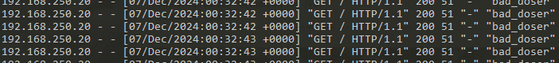

# Демонстрация проведения Dos атаки

Данный проект показывает как провести простейшую Dos атаку.

## Содержание

- [Описание проекта](#описание-проекта)
- [Требования](#требования)
- [Запуск проекта](#запуск-проекта)
- [Проверка работы](#проверка-работы)
- [Запуск атаки](#запуск-атаки)
- [Защита](#защита)
- [Балансировка](#балансировка)
- [Анализ](#анализ)
- [Отладка](#отладка)
- [Остановка и удаление контейнеров](#остановка-и-удаление-контейнеров)
- [Полезные ссылки](#полезные-ссылки)

## Описание проекта

- **Nginx**: Используется для балансировки трафика на сервер Apache.
- **Apache-сервер**: Контейнер с Apache, который обслуживает простой HTML файл.
- **Docker Compose**: Управляет всеми сервисами, поднимая их с помощью одного файла конфигурации

## Требования

Перед запуском проекта убедитесь, что на вашем компьютере установлены следующие инструменты:
- **Docker**: [Установка Docker](https://docs.docker.com/get-docker/)
- **Docker Compose**: [Установка Docker Compose](https://docs.docker.com/compose/install/)

## Запуск проекта

1. Склонируйте репозиторий с проектом:

```bash
git clone <ссылка на репозиторий>
cd <название директории>
```
2. Запустите виртуальные машины:
```bash
vagrant up 
```
Когда вы увидите, что во время запуска не было ошибок и уведомление об успешном запуске "VM IS READY!", можете продолжать работу.
3. Зайдите в виртуальную машину Веб Сервера:
```bash
vagrant ssh WebServer 
```
4. Запустите контейнеры с помощью Docker Compose:
```bash
cd /opt/server1
docker-compose up -d #запуск в фоновом режиме
```
5. Docker Compose запустит:
- Один контейнер с Nginx.
- Один контейнер с Apache-сервером.

## Проверка работы

1. Откройте браузер и перейдите по адресу [http://localhost:8080](http://localhost:8080).
2. На странице вы можете увидите надпись:
   - **Backend 1**
Что значит - докер контейнеры запустились и корректно работают.

3. Вы также можете проверить работу с помощью командной строки. Введите следующую команду раз:

```bash
curl http://<IP addr vm>>:8080
```
Во время установки виртуальной машины был указан 192.168.250.10
При каждом выполнении команды будет выведена HTML-страница от Apache-сервера. Пример вывода:

```bash
<html>
<body>
    <h1>Backend 1</h1>
</body>
</html>
```

## Запуск атаки
1. Зайдите в виртуальную машину Клиента:
```bash
vagrant ssh Client
```
2. Перед тем как начать атаку на стороне Веб Сервера разделим консоль для более удобного просмотра.
```bash
tmux new-session \; split-window -h \; split-window -h
```
Для передвижения между ними используйте сочетание клавиш ctrl+b и нажатие клавиш стрелочек <- ->
3. В каждом из окон пропишите следующие команды:
- 1 - `docker logs -fn 1 nginx` - для наблюдения за запросами на сервер  
- 2 - `htop`- для наблюдения за системой
4. На сервер клиента запустите атаку:
```bash
cd /opt
python3 client.py 
```
Вы получите сообщение "Client start send to http://192.168.250.10:8080"
5. Переходим во вкладку с веб сервером и наблюдаем за системой
и наблюдаем большое количество приходящих запросов


А также нагрузку на систему


В какой-то момент нагрузка уменьшится почти до 0.


И если проверить в этот момент сайт через браузер, то увидим 500 ошибку. 

Поздравляю! Вы положили сервер!

6. Остановите атаку нажав ctrl+c в консоли сервера клиента
## Защита
Один из методов защиты - прописать дополнительные правила в конфигурационном файле nginx. 
1. Например, запретить получение запросов с ip адреса злоумышленника.

Для этого в конфиг файле /opt/server1/nginx.conf в объекте location добавим строчку:
```bash
deny 192.168.250.20;
```
Проверим корректность новой конфигурации nginx и перезапустим его

```bash 
docker exec nginx nginx -t
>> nginx: the configuration file /etc/nginx/nginx.conf syntax is ok
>> nginx: configuration file /etc/nginx/nginx.conf test is successful

docker exec nginx nginx -s reload
```
После этого запускаем атаку и смотрим логи.

Получаем вот такой ответ:
```
2024/12/07 01:09:10 [error] 55#55: *145903 access forbidden by rule, client: 192.168.250.20, server: , request: "GET / HTTP/1.1", host: "sitename.com"
192.168.250.20 - - [07/Dec/2024:01:09:10 +0000] "GET / HTTP/1.1" 403 153 "-" "bad_doser"
192.168.250.20 - - [07/Dec/2024:01:09:10 +0000] "GET / HTTP/1.1" 403 153 "-" "bad_doser"
```
Nginx блокирует, а сервер не падает

## Балансировка
В качестве защиты от большого количества запросов также можно настроить балансировщик запросов с помощью nginx на три сервера. 

Есть разные режимы балансировки, например по умолчанию стоит режим **round-robin**, то-есть запросы будут переадресовываться на сервера по очереди. В данной работе будем использовать режим **least-connected** - отправляется запрос на менее занятый сервер.

Раскомментируем в файле docker-compose.yml два дополнительных контейнера. 

В файле конфигурации nginx раскомментируем два сервера и соберем контейнеры заново, используя команду `docker compose up`

Теперь при загрузке страницы мы будем видеть разные надписи соответствующие номеру сервера. Так как мы пока единственный клиент, сервера будут переключаться по очереди. Но после запуска Dos атаки будет появляться менее загруженный сервер.

## Анализ

Во время выполнения работы можно запустить захват трафика для дальнейшего анализа, например, в WireShark.
```bash
сd /opt
sudo tcpdump -i enp0s8 host 192.168.250.10 -w capture.pcap
```
- enp0s8 - сетевой интерфейс, можно посмотреть на каком интерфейсе находится ваш ip используя команду `ip a`

После окончания атаки нажимаете Ctrl+C и файл сохраняется.

У себя на пк запускаете файл (перед этим надо установить программу [WireShark](https://www.wireshark.org/download.html))

Для более удобного просмотра можно убрать лишние пакеты syn, ask, fin. 

В поле фильтра введите `tcp.flags != 0x0011 && tcp.flags != 0x0002 && tcp.flags != 0x0012 && tcp.flags != 0x0010`, тогда останутся чистые http запросы.

И вот так примерно это будет выглядеть:


Первый запрос - запрос с браузера. Дальше начинается атака.

Пролистнув ниже заметим, что пошли статусы ответов 403. В этот момент мы внесли изменения в конфиг файл nginx для запрета определенного ip адреса.

## Отладка
Если вам необходимо отладить работу системы или выяснить, почему контейнеры не работают так, как ожидалось, можно воспользоваться следующими командами:

Проверка статуса контейнеров - выполните команду для просмотра состояния всех контейнеров:
```bash
docker compose ps
```
Эта команда покажет список запущенных контейнеров и их текущее состояние.

Просмотр логов Nginx: для анализа логов Nginx выполните:
```bash
docker logs -fn 1 nginx
```
Просмотр логов Apache-сервера:
```bash
docker logs -fn 1 server1
```

## Остановка и удаление контейнеров
Когда тестирование завершено, можно остановить и удалить все запущенные контейнеры:

Остановка всех контейнеров: чтобы остановить контейнеры, выполните:

```bash
docker compose down
```
### Полное удаление контейнеров и связанных данных:

Если вы хотите не только остановить контейнеры, но и удалить все тома данных, выполните:
```bash
docker compose down -v
```
Это удалит все данные, созданные контейнерами (например, логи, кэш и временные файлы).

## Полезные ссылки

Для более глубокого изучения инструментов, используемых в проекте, ознакомьтесь с официальной документацией:

- [Документация Nginx](https://nginx.org/ru/docs/) — Официальная документация по Nginx, включая настройки прокси и балансировки нагрузки.
- [Документация Apache](https://httpd.apache.org/docs/) — Руководство по установке и настройке Apache HTTP Server, используемого в качестве бэкендов.
- [Документация Docker](https://docs.docker.com/) — Полное руководство по Docker, включающее инструкции по установке, основным командам и использованию контейнеров.
- [Документация Docker Compose](https://docs.docker.com/compose/) — Документация по Docker Compose для управления многоконтейнерными приложениями и оркестрацией сервисов.
- [Docker Hub — Nginx](https://hub.docker.com/_/nginx) — Страница с официальным образом Nginx на Docker Hub.
- [Docker Hub — Apache (httpd)](https://hub.docker.com/_/httpd) — Страница с официальным образом Apache HTTP Server на Docker Hub.
- [Tmux](https://habr.com/ru/articles/327630) - Страница с описанием и примерами для команды tmux
- [SampleCaptures](https://wiki.wireshark.org/SampleCaptures#arprarp) - Страница с примерами pcap файлов от wireshark.
- [YouTobe](https://youtube.com/playlist?list=PLcDkQ2Au8aVNXuTxX18aw5uP4MrBeg16p) - Крус по основам анализа сетевого трафика.
Эти ресурсы помогут вам лучше понять, как работают компоненты данного проекта, и освоить их для дальнейшего использования.

---

Проект готов к использованию. Удачи в изучении!
